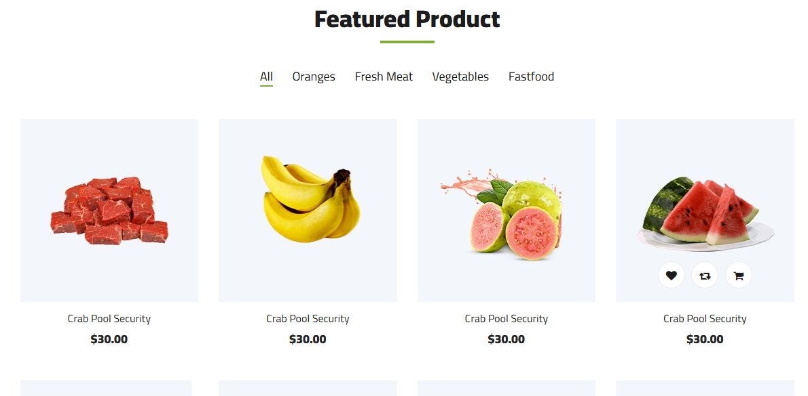
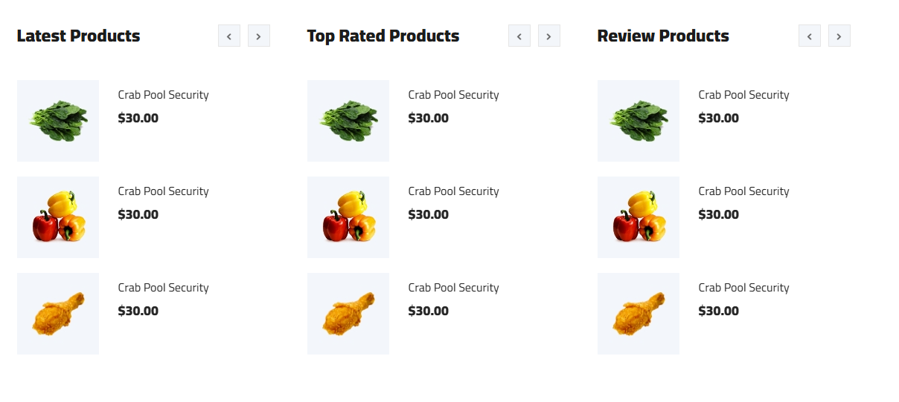
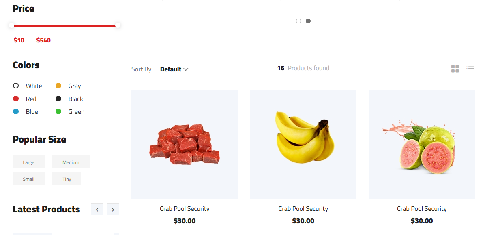
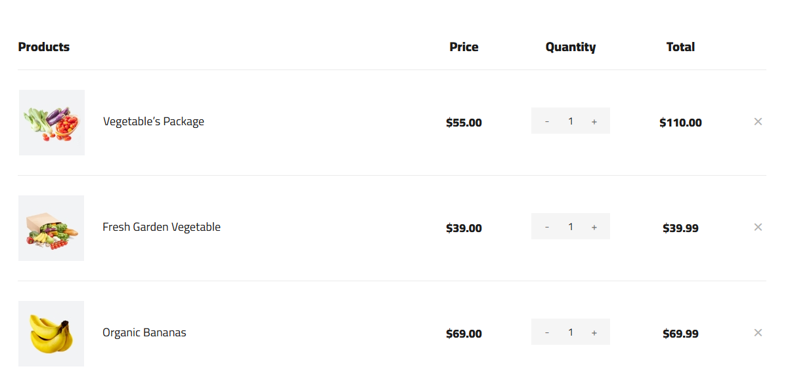

# 📚 DelyRapi – E-commerce con Arquitectura de Microservicios

**DelyRapi** es una plataforma moderna para la venta de artículos de hogar diseñada bajo una **arquitectura de microservicios** que garantiza escalabilidad, resiliencia y mantenibilidad. 🚀

---

## 🚀 Características Principales

- **Servicio de autenticación**: Implementado con Express, JSON Web Token (JWT) y MongoDB (Stateful).
- **Servicio de tickets**: Gestión de compras, desarrollado con Express + TypeScript, integrado con NATS Streaming y MongoDB (Stateful).
- **Servicio de órdenes**: Generación de eventos para pagos y cancelaciones.
- **Servicio de pagos**: Integración con Stripe y Express API.
- **Mensajería y colas**: Comunicación asíncrona entre servicios con NATS Streaming, Redis y Bull.
- **Cliente Web**: Next.js + React, optimizado para SEO y SSR.
- **Orquestación y despliegue**: Docker + Kubernetes, con perfiles de desarrollo y despliegue usando Skaffold.

---

## 🖼️ UI

  
  
  
  
  
  

---

## 🛠️ Tecnologías Utilizadas

### **Frontend**
- Next.js + React
- Zustand para manejo de estado global
- SSR y optimización SEO

### **Backend**
- Express + TypeScript
- Microservicios en Docker, gestionados con Kubernetes
- MongoDB (Stateful) para persistencia
- Redis + Bull para colas
- NATS Streaming para mensajería
- Stripe API para pagos

### **Testing**
- Unit tests con ts-jest
- Integration tests con Supertest y Mocks

### **DevOps**
- Skaffold para perfiles de despliegue
- CI/CD con integración en Kubernetes

---

## 🧩 Patrones de Diseño Implementados

- **Repository Pattern**: Abstracción del acceso a datos.
- **Factory Pattern**: Creación centralizada de objetos complejos.
- **Observer Pattern**: Comunicación reactiva vía eventos NATS.

---

## 🛡️ Buenas Prácticas Adoptadas

- Principios **SOLID**
- **API Versioning** para compatibilidad hacia atrás
- **Logging estructurado** con trazabilidad distribuida
- **Pruebas unitarias, integración ** con cobertura controlada

---

## 📊 Observabilidad y Escalabilidad

- **Alertas proactivas** ante anomalías
- **Autoescalado horizontal (HPA)** en Kubernetes
- Balanceo de carga con **Ingress Controller**

---

## 🌐 Demo

🔗 [Ver aplicación en acción](https://apkpure.com/p/org.inkasoft.soykachimbo)

---

## 💡 Contribuciones

1. Haz un fork de este repositorio. 2. Crea una rama con tu funcionalidad:
bash
   git checkout -b mi-nueva-funcionalidad
3. Realiza tus cambios y haz commit:
bash
   git commit -m "Añadida nueva funcionalidad"
4. Haz un push a tu rama:
bash
   git push origin mi-nueva-funcionalidad
5. Crea un Pull Request.

## 🌟 Agradecimientos 
A mi madre.🙌
---

### 📧 Contacto

Si tienes alguna pregunta o sugerencia, no dudes en contactarme:
- ✉️ **Email**: [emamanix@gmail.com](mailto:emamanix@egmail.com)
- 💻**GitHub**: [https://github.com/AlessS4ndro](https://github.com/AlessS4ndro69)
- 📞**Whatsapp**: [Envíame un mensaje](https://wa.me/51925968311)

---
